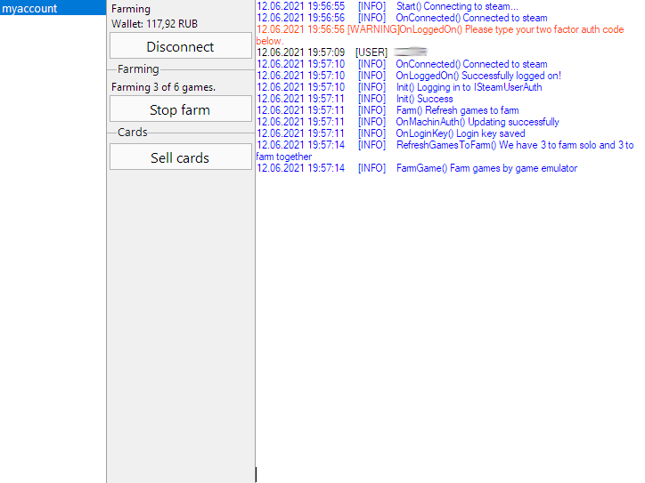

# Steam Multi Account manager

    

This is a manager for simultaneously idling games on few accounts for farming steam cards via emulator.  
Inpired by [ArchiSteamFarm](https://github.com/JustArchiNET/ArchiSteamFarm)

### Available features:
- Loging with two factor authentication
- Farming cards from multiple account simultaneously
- Selling cards with median price from market

## Warning
This project is abandoned, so it may not work as expected.